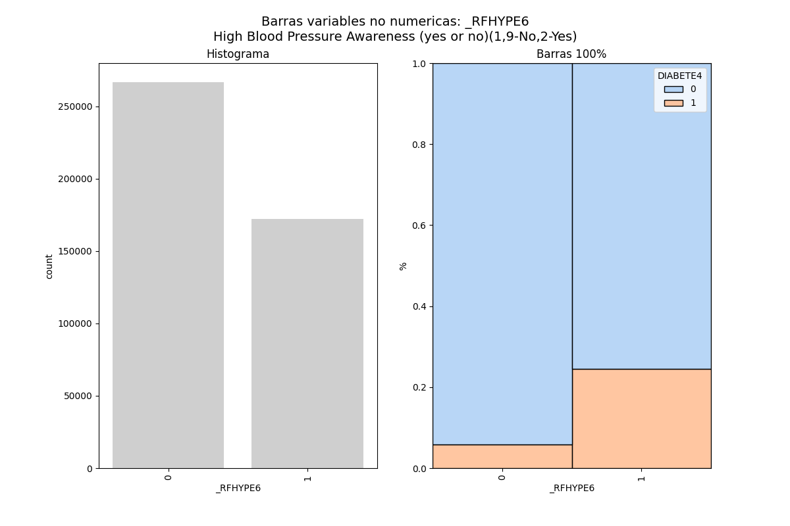

Este bloque tiene por objetivo dejar identificados algunos insight obtenidos del analisis grafico de las variables.

Las variables que no sean nombradas poseen un comportamiento similar para aquellas personas que padecen diabetes como
para las personas que no lo padecen. 

Este analisis se hace para encontrar patrones que pudieran indicar que la persona padece diabetes. 

1. Presión alta (_RFHYPE6):    

Las personas que poseen problemas de presión padecen de diabetes en mayor porcentaje que aquellas personas que no 
tienen problemas de presión. 

|  Presión  | S/Diabetes | C/Diabetes | % Con diabetes |
|:---------:|:----------:|:----------:|:--------------:|
|    No     |  251.002   |   15.558   |     5,83%      |
|    Si     |  130.075   |   42.058   |   **24,43%**   |

Las personas con presion padecen diabetes un 24,43% mientras las que no tiene presion solo padecen diabetes un 5,83%

2. asd

3. asd